  

  <b>Open to:</b> security internships and entry-level SOC / analyst roles · remote · available from April 2027 
  <b>Timezone:</b> UTC−6 (Chihuahua, MX) · <b>Languages:</b> Spanish (native), English (B2, EF SET)

  
  

Building strong fundamentals before tools: networking, Linux, Windows and Python applied to security.
All my training is done in English, 30–45 minutes every day.

- [ ] TryHackMe · Pre Security
- [ ] TryHackMe · Cyber Security 101
- [ ] TryHackMe · SOC Level 1 &nbsp;/&nbsp; Jr Penetration Tester
- [ ] Home SOC lab for my thesis
- [ ] Cambridge C1 Advanced (English)

Before security, I spent years in competitive esports as a **coach and analyst** (Valorant), including FlyQuest, Nyx eSports, 19esports and SLTitans Esports.
That work was reviewing hours of footage to find patterns, writing reports, and communicating in English with international teams under pressure.
Same instinct I'm now applying to logs and network traffic.

<b>Open full dossier</b>

 

| | |
|:--|:--|
| **Education** | B.Eng. Software Engineering, Universidad Autónoma de Chihuahua (2023 – Apr 2027) |
| **Thesis** | Evaluating SIEM detection coverage by log source in a SOC lab |
| **Environment** | Windows + WSL2, virtual machines, Linux |
| **Esports** | Valorant Head Coach — SLTitans Esports, 19esports, Nyx eSports · Analyst — FlyQuest · Coach — Team Cruelty |

  

<i>Transmissions intercepted automatically every 12 hours.</i>

<!--START_SECTION:activity-->
<!--END_SECTION:activity-->

  

